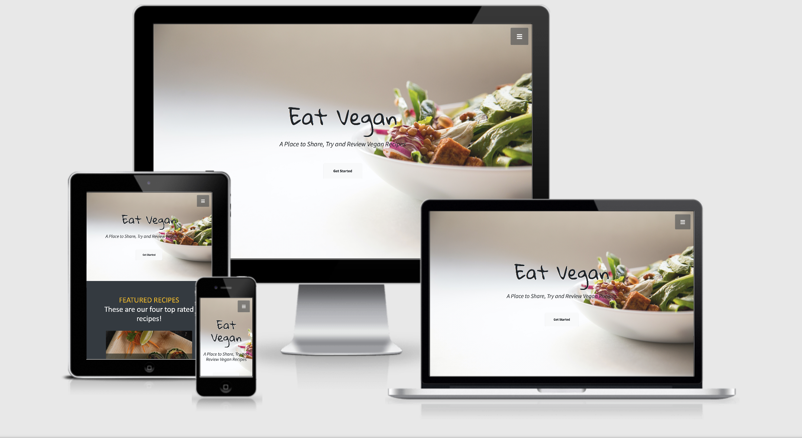

# Eat Vegan Recipes
## Code Institute: Milestone Project 3 - Jamie Rolls
---

Eat Vegan Recipes is a recipe site dedicated to Vegan food, the recipes are added by and reviewed by the sites visitors. The site is designed to be easy to navigate, promoting a simple layout with minimal but effective and purposeful features. 

#### **Project Requirements:**
Build an interactive front-end website that responds to user actions and alters the way the site displays data/information.

Required Technologies : HTML, CSS, JavaScript, Python+Flask, MongoDB.
Optional: Include use of JQuery, other Javascript libraries and external APIs.

A live version of the site is available [here.](https://ms3-eat-vegan-recipes.herokuapp.com/)

# Table of Contents

1.  [Strategy & Scope](#strategy-and-scope)
    * [UX](#ux)
        * [Business Objectives](#business-objectives)
        * [User Objectives](#user-objectives)
        * [Project goals](#project-goals)
        * [Mandatory Requirements](#mandatory-requirements)
        * [User Stories](#user-stories)
2.  [Structure](#structure)
    * [Design Process](#design-process)
        * [Page Structure](#page-structure)
            * [Home](#home)
            * [Recipes Page](#recipes-page)
            * [Individual Recipe Page](#individual-recipe-page)
            * [Submit / Edit Recipe Page](#submit-and-edit-recipe-page)

# Strategy and Scope
## UX

#### Business Objectives

- The site will attract users seeking Vegan recipes which are tried and tested by others. As a community contributed site, it is expected that recipes which are shared have been verified.
- The site should make it easy for its users to add recipes, leave reviews for others and verify/like other recipes.
- The site will have filter and search functions to support ease of use and site navigation.
- Social media channels will be linked on all pages, to build a community following on other 'Eat Vegan Recipes' platforms.

#### User Objectives

- Users will be looking for recipes in the every growing Vegan food movement. Recipes are desired for different meals throughout the day.
- A user may want to share a favorite recipe with others, this should be easy to complete with little hassle.
- Users may have want to search for a recipe, they use Eat Vegan Recipes due to the ever growing recipe list and the supporting reviews/votes system in place for recipes.

#### Project Goals

- Create a clear, well designed website for the user to navigate with ease.
- Use a consistent, clear theme throughout the site.
- Consider appropriate pages/layout and content to fulfil business/user objectives.
- Integrate a database into the webapp using MongoDB + Flask, the database will store recipes, reviews and other supporting information.
- Consider user authentication, to allow users to edit their own recipes if desired.
- Fulfil all mandatory project requirements as a minimum. (these are listed below)

#### Mandatory Requirements

1. Data handling: Build a MongoDB-backed Flask project for a web application that allows users to store and manipulate data records about a particular domain. If you are considering using a different database, please discuss that with your mentor first and inform Student Care.
2. Database structure: Put some effort into designing a database structure well-suited for your domain. Make sure to put some thought into the nesting relationships between records of different entities.
3. User functionality: Create functionality for users to create, locate, display, edit and delete records (CRUD functionality).
4. Use of technologies: Use HTML and custom CSS for the website's front-end.
5. Structure: Incorporate a main navigation menu and structured layout (you might want to use Materialize or Bootstrap to accomplish this).
6. Documentation: Write a README.md file for your project that explains what the project does and the value that it provides to its users.
7. Version control: Use Git & GitHub for version control.
8. Attribution: Maintain clear separation between code written by you and code from external sources (e.g. libraries or tutorials). Attribute any code from external sources to its source via comments above the code and (for larger dependencies) in the README.
9. Deployment: Deploy the final version of your code to a hosting platform such as Heroku.
10. Make sure to not include any passwords or secret keys in the project repository.

#### User Stories

1. As a visitor to the site, I want to easily find a recipe for lunch and for dinner. The recipe should have reviews.
2. As a visitor to the site, I want to share one of my favorite vegan recipes with others.
3. As a visitor to the site, I want to search for a light snack to make for some Vegan friends.
4. As a previous visitor to the site, I want to edit a recipe that I added to the site on a previous visit.
5. As a previous visitor to the site, I want to review a recipe that I cooked last week. It would be good to be able to search for the recipe, as I remember the name of it.

# Structure

## Design Process

#### Page Structure

* The site is designed to remain simple and stylish throughout, most of the navigation will be completed via call to action buttons. An optional navbar will be collapse at the top right of each screen, containing links to key pages and search filters. 
 This design choice will support a primary user journey of locating a recipe quickly which is suited to the user.

* Elements from a Start Bootstrap theme were customised and utilised accross the site. The theme can be found here: ------ . The simplicity and effectiveness of the call to action buttons were supportive of my decision to use this theme as part of 'Eat Vegan Recipes'

* Research on recipe page layouts was conducted accross various food and recipe websites, this information has inspired and aided my decisions on page design for individual recipes. The purpose was to display content clearly, which is easy to read on different devices. As recipes may be viewed whilst cooking, this is an important consideration.

* I began to outline the content requirements for the site and thought about the best way for a user to navigate through this content.

* The following pages were chosen to be created: 
    - Home (landing page)
    - All recipes (with search and filter buttons)
    - Individual recipe page
    - Submit Recipe form

* A collapsed nav bar containing links to a the following will be present on all pages in the top righthand corner of the screen:

- All Recipes
- Breakfast Recipes
- Lunch Recipes
- Dinner Recipes
- Dessert Recipes
- Add Recipe
- Login / Sign Up
- Social Media Icons

#### Home - landing page

* The landing page has four main sections followed by the footer. 

    1. Header, spanning the full viewport. Consisting of a relevant background image. website logo, site name, call to action button (link to next section on page)
    2. Top four rated recipes (these will be dynamic, displaying the four reciped from the databasw with the highest votes)
    3. Recipe links - Four links to show recipes from different categories - these will open a new page.
    4. A call to action button - allowing users to add their own recipe - This will require authentication/login to access the submit recipe page.

#### Recipes Page

* The all recipes page (get_recipes.html) will dynamically show recipes from the database, depending on search terms or filters which have been applied. There will be four sections on the page followed by the footer. 

    1. Header - reduced size, to contain the site name and the collaped navbar link.
    2. Recipe search and filters section.
    3. Recipe cards, with overlaid text (name, short description, votes)
    4. A call to action button - allowing users to add their own recipe - This will require authentication/login to access the submit recipe page.

#### Individual Recipe Page

* The individual recipe page will display a single recipe from the database, the recipe would have been selected from the 'All recipes page'. This page will display all recipe data from the database. There will be four main sections followed by the footer. 

    1. Header - reduced size, to contain the site name and the collaped navbar link.
    2. Recipe - Header, image and short description. Followed by ingredients and method.
    3. Reviews - Display reviews which have been left by other users - which are related to this recipe.
    4. Two call to action buttons - 
        - Button linking to the submit recipe form page. This will require authentication/login to access.
        - Button linking the user back to the 'All recipes' page.

#### Submit and Edit Recipe Page

* This page consist of three sections followed by the footer.

    1. Header - reduced size, to contain the site name and the collaped navbar link.
    2. Recipe submission form - This will contain all fields required to fulfil a recipe entry in the database. Fields will be required and the form will provide user feedback to ensure it is filled correctly. A submit button will be present at the end of the form, which pushes the inputs to the database.
    3. A call to action button linking the user back to the 'All recipes' page.

# Skeleton

## Wireframe designs

Wireframes were designed using Balsamiq, for three primary breakpoints - Desktop, Tablet and Mobile.

- Desktop Wireframes.

- Tablet Wireframes.

- Mobile Wireframes.

## Wireframe and Final Project Differences

- Home Page
    - Recipe page links are in a single row on mobile - containing all four links. As opposed to opting for a single row per link. This was decided to assist the user experience by reducing the need to scroll excessively.
- Recipes
    - Recipe filter links and icons on tablet and mobile remain in a single row, as is on the desktop Wireframe. This was found to improve the look of the site and maintain consistency between screen sizes. 
- Recipe Page
    - The recipe page on desktop adopts a more simple layout, which compliments the site design. The recipe image occupies the top of the page on a single row. All recipe information follows the image. 
- Add Recipe form
    - The form is now displayed on desktop, as it is on tablet and mobile wireframes. This design choice supports the site design and it was found the additional column in the wireframe design was not required to display information.
- Navbar
    - The navbar adopted a minimalistic design, the recipe types have been collapsed under a single link 'recipes'. Which can be expanded to display the additional links when desired. 
    - Login / Register links added, displayed accordingly.
    - Add recipe link, displayed accordingly.

## Responsive Page Design

The site has been designed to operate well on all screen sizes. As a core purpose of the site is to host recipes, it is expected that the site will be viewed on tablet and mobile devices often, whilst in the kitchen. With that in mind, the site content and layouts have been designed to support a positive user experience.

- Page Header
    - Fontsize and header height is reduced on smaller devices to ensure best use of space is acheived.
- Home page
    - The top four recipes are displayed in a single column on tablet and mobile.
    - The links to the 'recipes' page are displayed in a single row on desktop and mobile. On tablet to make best use of the space, the links are displayed over two rows.
- Recipes
    - The recipe cards are displayed in rows of three on desktop, this is reduced to a single recipe card per row for tablet and mobile size screens.
    - Recipe card pagination is set to 6 recipes per page, to reduce loading times and improve the user experience.
- Recipe Page
    - The recipe information stacks on tablet and mobile devices.
    - The edit and delete recipe buttons stack below the recipe 'like' info, on mobile devices.
    - The delete comment button, stacks below corresponding comments, if applicable. On mobile devices.
- Edit / Add recipe page
    - Padding and margin is adjusted on smaller screen sizes to maintain form conformity and a positive user experience.

## Database Design and structure

* The database 'eat_vegan_recipes' will consist of three collections. Compiled and hosted using [MongoDB](https://www.mongodb.com/) Recipes & Reviews. 

### Recipe Structure
1. _id - ObjectId - (generated by mongoDB)
2. name - str
3. category - str 
4. short_description - str
5. recipe_info - array
6. ingredients - array
7. method - str
8. img_url - str
9. votes - int
10. added_by - str

### Categories Structure
1. _id - ObjectId - (generated by mongoDB)
2. name - str

### Reviews Structure
1. _id - ObjectId - (generated by mongoDB)
2. recipe_review - str
3. recipe_rating - str
4. recipe_id - str
5. added_by - str

### Users

1. _id - ObjectId - (generated by mongoDB)
2. username - str
3. password - str - (password hash generated by werkzeug.security)

# Surface

## Colours

Colour Palette - Three main colours that compliment the design of the site are:

 -  - `#2c4650` - Section background
 -  - `#343a40` - Dark section background
 -  - `#1D809F` - Page buttons, navbar
 -  - `#f8f9fa` - Page buttons
 -  - `#ecb807` - Page fonts

* Other various shades of grey are used to highlight, surround and drop shadows on elements throughout the site.

## Font Choice

The following fonts were applied to the site. 

- Gloria Hallelujah
- Thasadith
- Monospace
- Source Sans Pro (default font - applied to body)

Gloria Hallelujah and Thasadith were obtained through Google Fonts. They are imported from 'Google Fonts' in the customer style.css file. 

# Features

## Sitewide

### Nav Bar

* The site uses Bootstrap to create a collapsed navbar. The navbar remains collapsed until engaged with.
* Links to the recipe page are hidden. They are displayed to the site user, when the 'recipes' link is engaged.

### Footer

* The site footer has social icons pinned to it.
* The footer has a dynamic copyright caption. Which updates the year, based on the current date.

## Home

### Header
 - The page header occupies the majority of the viewport on most devices.
 - Below the site name and short description a dynamic call to action button is present. 
    1. There are three buttons which rotate on a Bootstrap carousel.
    2. The buttons display different links based on if the a user is logged in to the site or not. ( Logged out: 'Get Started', Logged in : 'Add Recipe')

### Top Recipes
- The top four recipes (based on heart count, hearts are added by site users to their favourite recipes) are displayed on the home page. These elements are dynamic and change based on the current recipe 'like' counts.
- Each of the recipe cards are links to the respective recipe page.
- A recipe like(hearts) counter is displayed on each of the recipe cards, this provides visual feedback to the site user.
- The recipe name and recipe type is overlayed the recipe image on each card. 
- A mouse hover event listener is present on each of the recipe cards, when focused the recipe image fades and an orange background colour is applies to the element with a reduced size.

### Recipe Links
- Recipe links are present on the home page, which direct the user to the 'recipes' page with an applied category filter. The category is passed as an argument using Flask and results are retreived using Python and MongoDB.

### Call to action button
- The call to action button at the bottom of the page as default displays 'Get Started', which directs the user to the login.html template
- If the site user is logged in, it displays 'Add Recipe', this directs the user to the add_recipe.html template.

## Recipes Page

### Search and Filter functionality
- The search function takes a text input, it retreives all recipes from the database which have the inputted reference in either the recipe name or description.
- The 'See All Recipes' button, retreives all recipes from the database and renders the page accordingly.
- The recipe category buttons retreive only recipes from the corresponding categories and render those recipes to the page. In addition the selected category button is highlighed with an orange outline. Providing visual feedback to the user, as well as the page header is updated to display which recipes are currently selected.

### Recipe cards
- Each rendered recipe card is a link the corresponding recipe page.
- A mouse hover effect is present on each card, which applies the same effect as the recipe cards from the home page.
- Only the recipe name is overlaying the recipe image. There is not a need to display the category type on this recipe card, as the user would have defined this themselves in reaching this page.

### Pagination
- Pagination is implemented into the recipes page, to display recipe cards over multiple pages. This reduces loading times and browser memory usage. As the database grows, this will be beneficial.
- Currently recipe cards are displayed at 6 maximum per page.
- Navigation buttons and page numbers are displayed below the recipe cards. These indicate to the user which page they are currently viewing and how many pages there are with the current filter or search terms.
- The navigation arrows allow users to go to the previous page or the next page. Page numbers are passed between templates and routes using Python & Flask - to ensure functionality.

### Call to action button
- The call to action button carries over the same functionality as the home page - detailed above.

## Recipe Page

### Image & buttons
- The recipe image is displayed accross the entire browser at the top of the page, on all devices. It is responsive and fills its container.
- If the user is logged into the site, they will see the following buttons directly below the image:
    1. Add (heart) to recipe (if the user is not the recipe author)
    2. Edit recipe (only if the user is the recipe author)
    3. Delete recipe (only if the user is the recipe author)

### Recipe information
 - All recipe details are pulled from the database and rendered in the main section of this page, in separate parts. There are identified with headers and small padding between sections. The use of background colour adds visual separation.

### Comments
- The ability to leave comments is a feature of the site. The add comment and rating section is directly below the recipe information, present on each recipe page. (this is only visible to logged in users)
- The comments and rating are added to the database with the recipe _id - which is referenced when rendering the correct comments for each recipe.
- The comments and rating are also added to the database with the user_id. This is used to identify comments that a user has written and allow them to delete the comment if they desire to. This is acheived by clicking the 'delete' button, directly next to the comment they have added.

### Call to Action buttons
- A carousel containing several buttons is present at the end of the recipe page. It contains the same buttons as the header on the 'home' page, with the same features.

## Add Recipe Page

### Categories
- The categories drop-down select box, draws from the categories database. The categories can be expanded easily in the future if desired, by updating the 'categories' collection in mongoDB.

### Form Design
- The form adopts a borderless design, with dynamic labels that move above input boxes when the user is focused on an input.
- Each input has its own validation rules and are required to submit the form. The validation rules help maintain consistency between recipes throughout the site.
- Upon submitting the form, data is passed into the 'recipes' database, hosted with mongoDB.

### Ingredients input
- Javascript is used to append/remove html input boxes to the page, for the ingredients inputs.
- Upon loading the page a single ingredient input is present on the form. Users can add additional inputs to the page by clicking the 'Add Ingredient' button.
- Users can remove any inputs they have added themselves, by clicking the 'Remove Ingredient' button.
- Users may also remove any input they have added themselves and clear text from the initial ingredient input box by clicking the 'Reset' button.

### Method input
- Javascript is used to append/remove html text area boxes to the page, for the recipe method input.
- The add / remove and reset button operate in the same way as the ingredient buttons detailed above.

## Edit Recipe Page
- The edit recipe page renders its form with the same code as the 'add recipe' page. Features are the same for both forms.
- When a user reaches the edit_recipe page, they would have opted to 'edit' a recipe which was added to the site by themselves.
- The form is populated with all of the selected recipe data from the database. Users can then edit this data as desired and submit changes to the database by clicking 'Submit Changes'.

## Authentication
The site uses authentication. Users that have signed up to the site have priviledge to conduct the following actions:

1. Add recipes to the site / Edit & Delete recipes added by themselves.
2. Like other users recipes.
3. Leave comments and ratings on recipes from other users / Delete comments added by themselves.

# Future Features

- Abilty to upload images to the database as an alternative to image url for recipes.
- Add search recipe feature to navbar.
- Add ability for users to edit comments they have added to recipes.
- Create profile page for registered users, which gives them easy access to recipes they have posted.
- Allow registered users to save recipes, so that they can quickly access them during future visits to the site.
- Add checkboxes next to recipe items, for user to mark off ingredients whilst using recipe.

# Technologies Used

## Languages

* HTML - base language used for this project.
* CSS - used for styling HTML code site wide.
* Python & Flask - Used to produce the backend code running the site.
    * OS - This project used OS to provide functions for interacting with the site.
    * Bson.objectid - Used to enable the use of ObjectID when referring to the _id data names within the MongoDB database.
    * Werkzeug - Werkzeug.security is used to provide password authentication for the site.
* JavaScript - used to make elements of the site interactive and support HTML & CSS styling.

## Libraries

* [Bootstrap](https://getbootstrap.com/) (4.5.2) - with supporting JS Script and tooltips. Used for the responsive grid system, styling elements and navbar creation.
* [FontAwseome](https://fontawesome.com/) (5.15.1) - used for all icons on the site.
* [Google Fonts](https://fonts.google.com/) - used for the Roboto fonts.
* [JQuery](https://jquery.com/) (3.5.1) - used throughout the site to target and manipulate HTML elements and also in conjunction with the Bootstrap library.

## Tools

* [MongoDB](https://www.mongodb.com/) - used to host user, recipe, comments and category data for the site in the form of databases/collections.
* [Gitpod](https://www.gitpod.io) - used as IDE for this project.
* [Git](https://git-scm.com/) - used for version control.
* [Github](https://github.com/) - used to host repository.
* [Heroku](https://dashboard.heroku.com/) - 
* [Balsamiq](https://balsamiq.com/) - used to develop initial scratch wireframes.
* [Figma](https://www.figma.com/) - used for creation of website theme/wireframe.
* [Am I Responsive](http://ami.responsivedesign.is/) - used for testing purposes and for the screenshot at the top of my README filed to display the web pages on different devices.
* [Google Chrome DevTools](https://developers.google.com/web/tools/chrome-devtools) - used for testing and debugging the site.
* [w3 html validator](https://validator.w3.org/) - used to test and validate my html code.
* [w3 css validator](https://jigsaw.w3.org/) - used to test and validate my CSS code.
* [jshint](https://jshint.com/) - used to test and validate all JS code.
* [ezgif](https://ezgif.com/) - used in testing.md to capture interactive elements into gifs.
* [Favicon generator](https://favicon.io/favicon-converter/) - used to generate favicons

# Testing

All-testing has been documented [testing.md](https://github.com/jamie120/ms3-eat-vegan-recipes/blob/master/documentation/testing.md)

# Deployment

* The site was developed in GitPod and pushed to the following remote GitHub repository - [REPO](https://github.com/jamie120/ms3-eat-eat_vegan_recipes)
    * The following GIT commands were used throughout deployment:
        * **git status** ------ used to check the status of files and any changes made / untracked.
        * **git add**   ------ to stage files ready to commit.
        * **git commit -m " "**  ------ to commit the files.
        * **git push** ------ to push the files to the master branch of the GitHub repo.

### Hosting on Heroku

* This site is hosted using Heroku, deployed directly from the master branch via GitHub. - [LIVE SITE](https://ms3-eat-vegan-recipes.herokuapp.com/)
    * The following steps were taken to complete the hosting process.
       
    1. Set **_debug=False_** in the app.py file.
    2. Created a requirements.txt file from the terminal, using **_pip3 freeze --local > requirements.txt_**, to allow Heroku to detect this project as a python app and any required package dependencies.
    3. Created a Procfile using **_echo web: python app.py > Procfile_** from the Gitpod terminal so Heroku would be informed on which file runs the app and how to run this project.
    4. Created a new Heroku app, **_ms3_eat-vegan-recipes** and set its region to Europe.
    5. Automatic deployment was set up on Heroku - On the app dashboard, in the deploy menu. Connect to GitHub section. The GitHub repository was searched for and connected to the app.
    6. In the settings tab on the app dashboard, 'Reveal Config Vars' was used to tell Heroku which variableS are required to run the app. The following config vars were added: 
        *  **_IP_** 
        *  **_PORT_**
        * **_SECRET_KEY_**
        * **_MONGO_URI_**
    7. In GitPod, a check was completed to ensure the master branch was upto date and all commits had been pushed to GitHub, ready for Heroku to deploy.
    8. Clicked the **_Enable Automatic Deploys_** button located in the **_Deploy_** section of Heroku to allow for automatic deploys.
    13. Clicked the **_Deploy Branch_** button located in the **_Deploy_** section of Heroku to finally deploy this project.
    14. Clicked the **_View_** button to launch this project's app.

    * The deployed site on Heroku will update automatically upon new commits to the master branch in the GitHub Repo : [REPO](https://github.com/jamie120/ms3-eat-eat_vegan_recipes).

### Cloning

To run this code locally, you can clone this repository directly into the editor of your choice by following the steps below:

1. Open Terminal.
2. Change the current working directory to the location when you want the cloned directory.
3. Type the following into your Terminal:  
    git clone https://github.com/jamie120/ms3-eat-vegan-recipes.git
4. Press Enter to create a local clone.

* To cut ties with this GitHub repository, type git remote rm origin into the terminal.

##### For more information regarding cloning of a repository click [here](https://help.github.com/en/github/creating-cloning-and-archiving-repositories/cloning-a-repository).

# Credits

## Content

All the written content of the website has been written by myself. 

## Media

### Images

The following images used for this app/website were taken from Unsplash:
  
Recipes - Unsplash:

* Avacado Pitta - https://unsplash.com/photos/MAbhhj3QCXQ - @atasteofwellbeing

* Vegan Burger - https://unsplash.com/photos/kPLccIMtS8E - @runningonrealfood

* Buddah Bowl - https://unsplash.com/photos/IGfIGP5ONV0 - @annapelzer

* Tofu Curry - https://unsplash.com/photos/PqsImnjuElM - @charlesdeluvio

* Red Lentil Dahl - https://unsplash.com/photos/gVOvZFcYBMY - @edgarraw

* Pistaccio Ice-cream - https://unsplash.com/photos/alEZLDPPRBU - @aribes

* Landing Page - Unsplash - https://unsplash.com/photos/Ww8eQWjMJWk - @hermez777

* Fish and chips - https://unsplash.com/photos/hfK401V_NXk - @jannerboy62

All other images were contributed from personal sources, of which no acknowledgement is required.

## Acknowledgements
   
### Sites used for information and support

* [W3C](https://www.w3.org/)
* [Stack overflow](https://stackoverflow.com/)
* [W3schools](https://www.w3schools.com/)
* [JQuery Documentation](https://api.jquery.com/)
* [Bootstrap Documentation](https://getbootstrap.com/docs/4.0/getting-started/introduction/)
* [JS Commenting](https://jsdoc.app/about-getting-started.html)
* [MongoDB Documentation](https://docs.atlas.mongodb.com/)
* [Python Documentation](https://docs.python.org/3/)
* [Reading for Pagination](https://www.thatsoftwaredude.com/content/6125/how-to-paginate-through-a-collection-in-javascript)

#### I received advice and support from
   * Oluwafemi Medale (mentor)
   * Code Institute - Slack Community (various students, tutors and mentors)

Sources used:

RANGE BUBBLE FOR RECIPE RATING - https://css-tricks.com/value-bubbles-for-range-inputs/

MONGODB Documentation - https://docs.mongodb.com/

Bootstrap Documentation - https://getbootstrap.com/docs/4.0/getting-started/introduction/

Start Bootstrap - https://startbootstrap.com/ - Used for page elements and inspiration from themes and templates.

Images - 

Recipes - Unsplash:

Avacado Pitta - https://unsplash.com/photos/MAbhhj3QCXQ - @atasteofwellbeing

Vegan Burger - https://unsplash.com/photos/kPLccIMtS8E - @runningonrealfood

Buddah Bowl - https://unsplash.com/photos/IGfIGP5ONV0 - @annapelzer

Tofu Curry - https://unsplash.com/photos/PqsImnjuElM - @charlesdeluvio

Red Lentil Dahl - https://unsplash.com/photos/gVOvZFcYBMY - @edgarraw

Pistaccio Ice-cream - https://unsplash.com/photos/alEZLDPPRBU - @aribes

Landing Page - Unsplash - https://unsplash.com/photos/Ww8eQWjMJWk - @hermez777

Fish and chips - https://unsplash.com/photos/hfK401V_NXk - @jannerboy62