# Testing

[back to README.md](https://github.com/jamie120/ms3-eat-vegan-recipes/blob/master/README.md)

## Contents

1. [Manual Testing](#manual-testing)
    * [Home Page](#home-page)
    * [Contact Page](#contact-page)
    * [FAQ Page](#faq-page)
    * [Services Pages](#service-pages)
    * [Rates Page](#rates-page)
    * [Service Finder](#service-finder)
    * [Site Wide](#site-wide)
    * [Fixes required](#fixes-required)
2. [DevTools](#devtools)
3. [Automated Testing](#automated-testing)
    * [Code Validation](#code-validation)
    * [Browser Validation](#browser-validation)
4. [User Stories](#user-stories)
5. [User Testing](#user-testing)
    * [My Mentor](#my-mentor)
    * [User review](#user-review)
6. [Post Review Changes](#post-review-changes)

## Manual Testing

### Testing completed using the following browsers: 

* Google Chrome (Version 87.0.4280.88) using MacOS on a monitor running at 1920 x 1080.
* Safari (Version 11.1.2 (13605.3.8)) using MacOS on a monitor running at 1920 x 1080.
* Apple iPad Pro 11" -  Safari and Google Chrome - latest build at 29/01/2021.
* Apple iPhone X - Safari and Google Chrome - latest build at 29/01/2021.

### **The following checks were completed on all browsers, any issues have been captured and documented below with screenshots.**

# **Home Page**
* Verify the page loads responsively on all device sizes. - :white_check_mark:
* Verify the carousel loads the call to action buttons with correct time delay (7000ms) - :white_check_mark:
* Verify the correct call to action buttons are displayed. If not logged in to the site, the first button displayed is 'Get Started' - :white_check_mark:
* Verify hover effect is present on top recipes - :white_check_mark:
* Verify the recipe count influences which recipes are displayed on the home page -:
    1. Add 5 likes to 'No fish and Chips' recipe.  
    2. Check the recipe is in position three on the home page. - :white_check_mark:

### Before

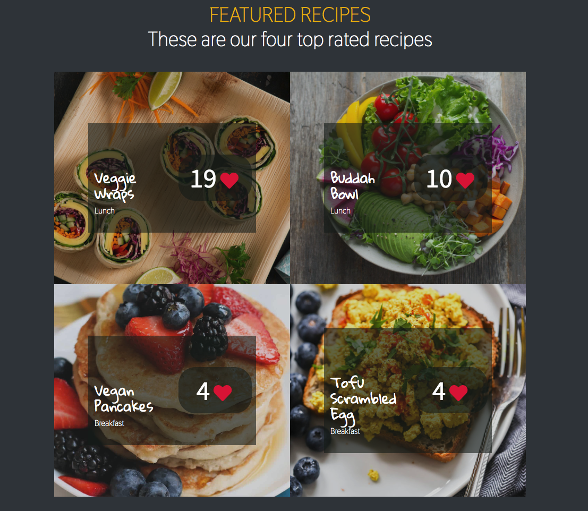

### After

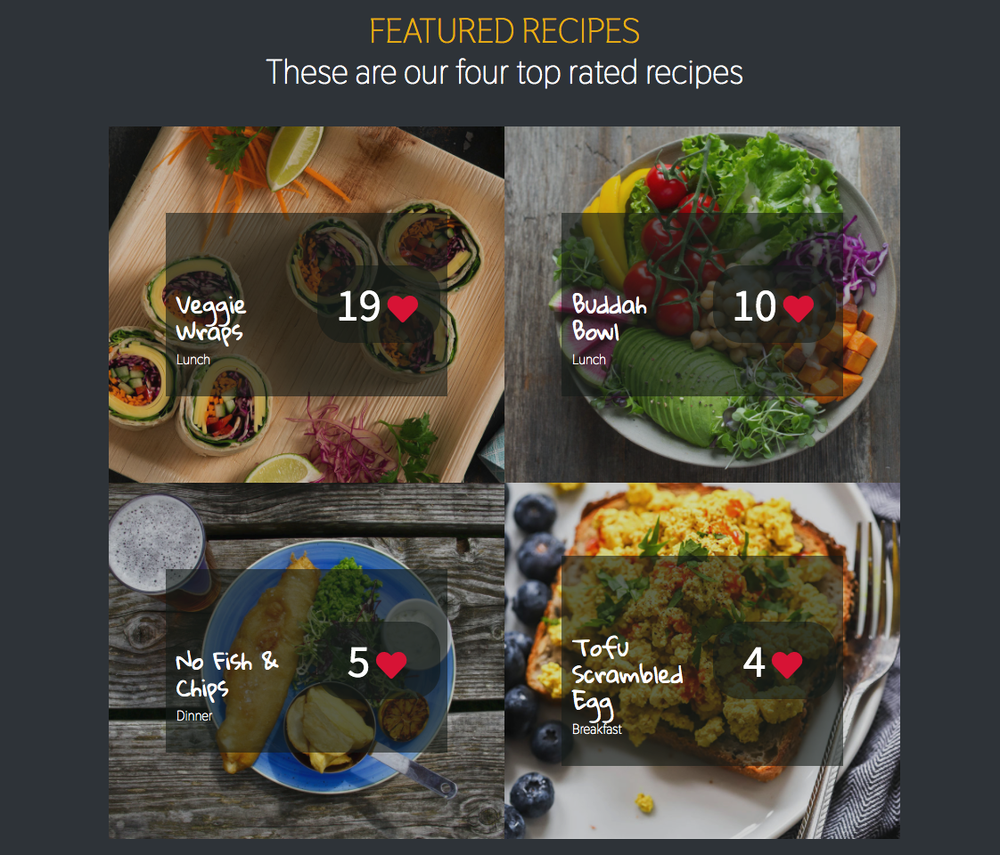

* Check all links in home.html direct users to the correct routes - :white_check_mark:

* Verify the message and call to action button at the bottom of the page change, if a user is logged in - :x:

### Not logged in

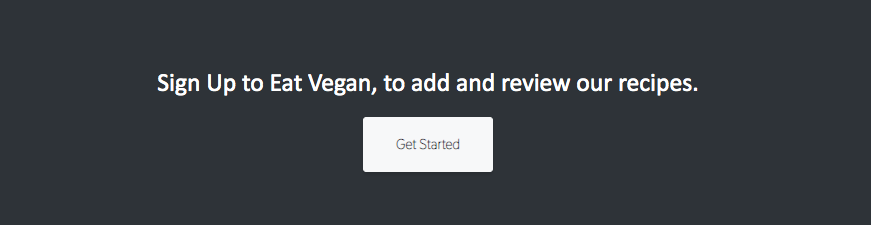 

### Logged in

### **Home Page - Fixes**

* Incorrect font style on call to action button caption, when user not logged in to site. 

# **Recipes Page**

* Verify the page loads responsively on all device sizes. - :white_check_mark:
* Verify all fonts are applied as expected - :white_check_mark:
* Verify the message and call to action button at the bottom of the page changes, if a user is logged in - :white_check_mark:
* Verify recipe cards render to the page correctly - :white_check_mark:
* Verify recipe cards redirect users to the individual recipe pages when clicked - :white_check_mark:
* Verify the four category buttons function correctly - re rendering the page with only recipes from the selected category - :white_check_mark:
* Verify selected category has applied CSS outline and HTML page header indicates the category with text - :white_check_mark:

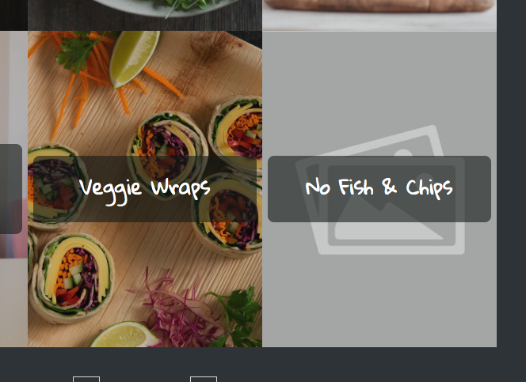

### Category selection - Dinner

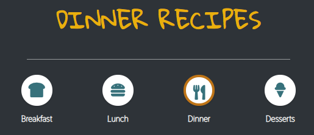

### Pagination 
* Verify page pagination functions correctly. At the time of testing there are 10 recipes - with a pagination setting of 6 recipes per page - :white_check_mark:
* Verify hover effect is present on recipe cards - :white_check_mark:

### Screenshots

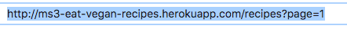
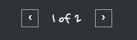

### Search function

* Verify the search function operates as expected. Tested search term (avacado)  - :white_check_mark:
* Verify 'see all recipes' button functions correctly - rerenders the page with all recipes - :white_check_mark:

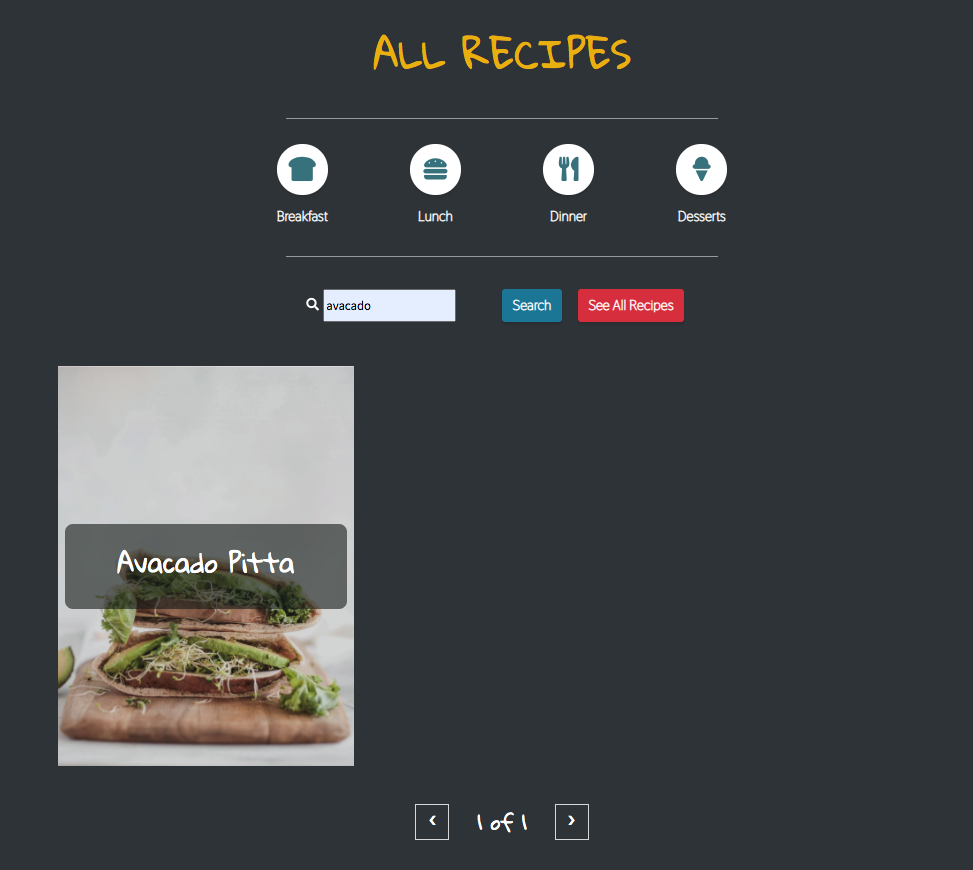

# **Recipe Page**

### General
* Verify the page loads responsively on all device sizes. - :white_check_mark:
* Verify all fonts are applied as expected - :white_check_mark:
* Verify all recipe info is rendered from the database correctly and in full - :white_check_mark:
* Verify the message and call to action button at the bottom of the page changes, if a user is logged in - :white_check_mark:

### Image
* Verify backup image renders if recipe img/url path generates an error - :white_check_mark:
    * To test - the image url was replaced with string 'testing' on the 'No fish and chips recipe.

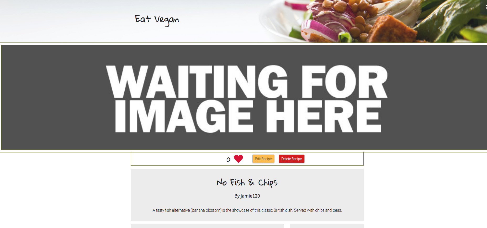

### Buttons
* Verify 'edit recipe' button is linked to the route 'edit_recipe' for the corresponding recipe - :white_check_mark:
* Verify 'delete recipe' button is linked to the route 'delete_recipe' for the corresponding recipe, and that the corresponding recipe is removed from the database if clicked - :white_check_mark:
* Verify 'delete' button in the comments section of the page - deletes the comment it corresponds to from the database - :white_check_mark:
* Verify buttons appear as required, based on authentication - :white_check_mark:
    * User logged in - viewing a recipe they are NOT author of - 
    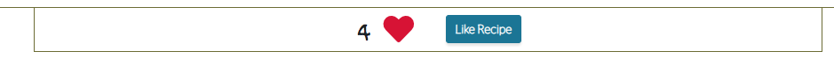
    * User logged in - viewing a recipe they ARE the author of - 
    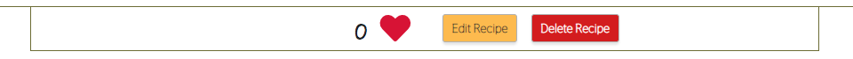
    * User logged in - viewing a comment/rating they ARE the author of -
    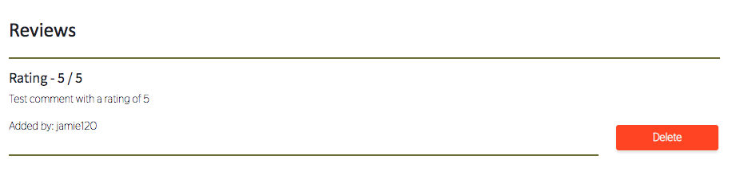

### Comments & rating
* Verify comments and ratings can only be added by users logged in with authentication - :white_check_mark:
* Verify users are not able to submit blank comments - :x:
* Verify the contents of the comments textarea is submitted to the database and renders to the page correctly once 'Add Comment & Rating' is clicked - :white_check_mark:

### **Recipe Page - Fixes**
* Add required attribute to ensure users cannot submit blank comments to the page.

# **Add Recipe Page**

### General

* Verify the page loads responsively on all device sizes. - :white_check_mark:
* Verify all fonts are applied as expected - :x:

### Form Fields
* Verify call categories are rendered from the database, into the select menu - :white_check_mark:
* Verify all labels are responsive, when a user focusses on corresponding input field - :white_check_mark:
* Verify all validation is present throughout the form as specified below:
    * Recipe Name - Minimum 5 characters :white_check_mark:
    * Short Description - Minimum 50 characters :white_check_mark:
    * Yield (Servings) - Maximum integer of 8 - must not be blank :white_check_mark:
    * Preptime - Integer - multiple of 5 - must not be blank :white_check_mark:
    * Cooktime - Integer - multiple of 5 - must not be blank :white_check_mark:
    * Ingredients - No maximum - must not be blank :white_check_mark:
    * Method - No maximum - must not be blank :white_check_mark:
    * Img URL - No maximum - must not be blank :white_check_mark:

### Form Buttons

#### Ingredients
* Add ingredient button - appends an empty input to the page, below the last ingredient input :white_check_mark:
* Remove ingredient button - removes the last input in the ingredients section, unless it is the only input present on the page :white_check_mark:
* Reset button - removes all but the first ingredient input field from the section and empties the first ingredient input field of any text :white_check_mark:

#### Method
* Add step button - appends an empty text area to the page, below the last step textarea :white_check_mark:
* Remove step button - removes the last textarea in the method section, unless it is the only textarea on the page :white_check_mark:
* Reset button - removes all but the first textarea from the section and empties the textarea field of any text :white_check_mark:

#### Add Recipe
* Verify if any form validation is not passed, the form will not submit, the user is indicated at field level of the criteria for the input field :white_check_mark:
* Verify if all validation is passed for the form, the data is submitted to the database 'Recipes' hosted with MongoDB :white_check_mark:

### **Add Recipe Page - Fixes**
* Style/font style missing from call to action button and caption at the bottom of the page.

# **Edit Recipe Page**

* Verify the page loads responsively on all device sizes. - :white_check_mark:
* Verify all fonts are applied as expected - :white_check_mark:
* Verify all validation is in place as specified for the 'Add Recipe' page - detailed [HERE](#form-fields)- :white_check_mark:
* Verify all fields are automatically filled in from the database, with corresponding recipe information :white_check_mark:
* Verify all buttons function the same as the 'Add Recipe Page' - detailed [HERE](#form-buttons) :white_check_mark:
* Verify any changes are submitted to the database when the 'Submit Changes' button is clicked :white_check_mark:

# **Site Wide**

### Navbar
* Verify navar is collapsed at all times -  :white_check_mark:
* Verify the scroll up arrow takes a user back to the top of the page when clicked (this is found bottom right of the viewport) - :white_check_mark:
* Verify the following links do NOT display in the navbar if logged out :
    * Logout :white_check_mark:
    * Add Recipe :white_check_mark:
* Verify the following links do NOT display in the navbar if logged in :
    * Register :white_check_mark:
    * Login :white_check_mark:
* Verify recipe categories are "display:none" class is toggled when 'Recipes' link is clicked :white_check_mark:
* Verify social icons link to the corresponding social media websites and that they open in a new window when clicked :white_check_mark:

### Footer
* Verify social icons link to the corresponding social media websites and that they open in a new window when clicked :white_check_mark:
* Verify the year is rendered as the current year in the copyright caption :white_check_mark:

# **DevTools**

Google DevTools was used within Google Chrome on MacOS throughout the development process. 

* Testing responsiveness of the site across several device models. 
    * Media queries written accordingly to support major devices available in devtool testing environment.

* Target elements and style with CSS, to test potential changes prior to coding them into relevant HTML.

* Console used to support development of JavaScript code.
    * console.log used at various points to check values of variables and function outputs, whilst developing logic for site.
    * Upon site completion - the console was checked for any errors
    * Once the site was completed, the console was checked for any errors on each page :white_check_mark:

# **Automated Testing**

## Validating the HTML, CSS and JS code

All of my code passed the following validation tests/services:
- HTML: [W3C Markup Validation Service](https://validator.w3.org/)
- CSS: [W3C Markup Validation Service](https://jigsaw.w3.org/css-validator/)
- JS: [jshint](https://jshint.com/)

* There were various HTML and CSS validation issues to resolve. These mainly referred to formatting my code and were easily fixable across the site.
* JS Validation highlighted the need the service-helper code to be parsed through Babel with the template literal plugin. This enables the code to be compatible with IE 11. 
* Various missing semicolons, unnecessary semicolons and various formatting errors were also highlighted. All have been resolved as required.

# **User Stories**

#### User Story 1
##### As a visitor to the site, I want to easily identify the business offer/purpose and be able to easily navigate the site to learn more if desired.
* Upon visiting the site, it is clear that the business offers audio services. 
* There is a navbar at the top of the page which clearly directs me to key pages.
* There are also several links at the top of each page, which allows me to reach a contact page, FAQ page and join a mailing list.

#### User Story 2
##### As a visitor to the site, I want to learn more about the services offered and listen to some of the work previously completed by the business.
* The home page indicates to me as a user, there are three main services offered - indicated by three elements at the bottom part of this page - and the main navbar.
* By clicking on one of these elements, I am taken to a main page relating to that selected service. On this page there are several audio examples, which play within the browser. 

#### User Story 3
##### As a potential client, I know what service I require and would like to see the business rates.
* Upon vising the site, I can see one of the main three links in the navbar is 'RATES'.
* On the rates page, I'm not overwhelmed with unnecessary information - the rates page allows me to select only the service I wish to see prices for.

#### User Story 4
##### As a potential client, I want to speak to somebody at the company to discuss a more bespoke service.
* I am able to vising the contact us page to leave a message to request a call-back. 
* I can call the business directly, there is a phone number available on the contact us page.
* Upon visiting the FAQ, this question has a response and encourages me to call.

#### User Story 5
##### As a potential client, I'm not sure which service would benefit my project the most. I need some support finding the right one.
* Whilst browsing the site, I had come across a feature called 'service-finder' I can get to this from the home page(index.html) and each of the services pages.
* A pop-up appeared after a few seconds on the home page (index.html). This appears to take me to an interactive app, the service finder. It was able to identify exactly what service I need.

# User Testing

## My-Mentor

A series of feedback and suggestions had been highlighted during a call on Friday 18th December 2020. Action has been taken for all of these suggestions and changes to the site and code. 

All changes are documented in Section 6 of this document (Post Review Changes)

## **User Testing**

A fellow Code Institute student took the time to thoroughly review the site content and code. They provided me with several ideas to improve both the user experience and improve the code efficiency.

All changes are documented in Section 6 of this document (Post Review Changes)

# Post Review Changes

* The following was addressed post testing and feedback. (changes are detailed in commit history dated 30/01/2021 onwards) :
    
 